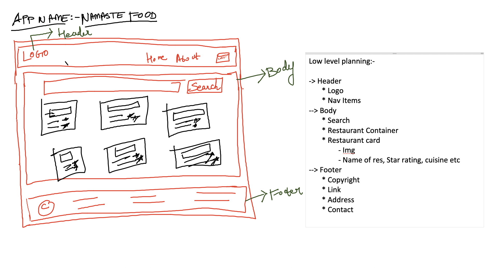

--> 

--> config driven ui:- based on the data that is coming from backend/api the ui is updated 

--> while doing .map giving key is very important because if you don't key then when a new data is coming the entire list gets rerendered instead of the particular data which is coming in. This is one of the great way of optimising