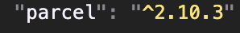

1. npm :- manages packages but it doesn't stand for "node package manager"
2. package.json :- also knowns as dependencies. NPM manages the packages/dependencies. 
package.json is a configuration of npm.
3. parcel package is used to bundle our app and make it ready for 
production.
4. We have 2 types of dependencies :-
--> dev dependencies (required for development)
--> normal dependencies (used in production as well)
5. ^ caret (infront of ). it means that install any version and if there is a minor update install that as well.
6. ~ tilde it means that it install all major versions as well.
7. package-lock.json will keep track of all the versions that is installed.
8. node_modules contains actual data of the dependencies we install
9. when we install one dependency it could internally be dependent on a few other dependencies which could have more dependencies and so on (which is knowns as transitive dependencies). Therefore there can be more than one package.json and package-lock.json in our app. 😉.
10. if we don't want certain files to go into production that I will put it under .gitignore
11. only gitignore nodu_modules because nodu_modules can be regenerated by using npm install.
12. npx parcel index.html (will start your app) (npx means executing a package)